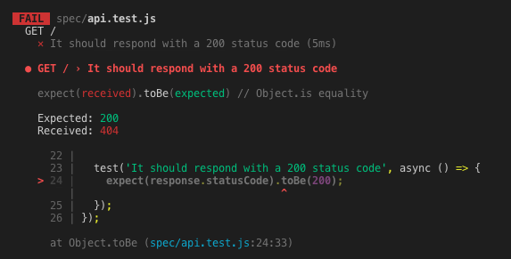

# Project initialisation

Let's create a new folder.

```
mkdir node_tdd && cd node_tdd
```

Let's initialize a new node project

```
npm init -y
```

We want to do some TDD while creating a simple API.
In this tutorial, we chose to use ExpressJS as a web framework, Sequelize as the ORM and a parsing middleware body-parse.

```
npm i express sequelize body-parser --save
```

We will use Postgres database, but you can as well use Mysql as well.

```
npm i pg
```

If your "sequelize" command is not found, you can fix it by installing the sequelize-cli.

```
npm i -g sequelize-cli
```

To keep the project clean, we will use dotenv package in order to get the dabasese credentials

```
npm install dotenv --save
```

Now, the base packages of our project are ready to be used. We can start the configuration.

# Sequelize set up
We first initialize our models and migrations folders with sequelize. This will create 2 new folders: a empty migrations folder, and models folder with an index.js file in it.

```
sequelize init:models
```

```
sequelize init:migrations
```

# Database creation (MYSQL VERSION)

Create /.env and /.env.test files like:
We have to create 2 files in project's root.
/.env
/.env.test

We will keep our databases credentials there.
You can for example name your db `node_tdd` and you test db `node_tdd_test`
Fill the below informations in each of these files.

```
DB_NAME=your_db_name
DB_USER=your_db_username
DB_PASSWORD=your_db_password
DB_HOST=127.0.0.1
DB_DIALECT=postgres
```

Create a file named `/config/config.js`

  ```javascript
const env = process.env.NODE_ENV || 'development'

switch (env) {
  case 'development':
    require('dotenv').config({path: process.cwd() + '/.env'})
      break
  case 'test':
    require('dotenv').config({path: process.cwd() + '/.env.test'})
}

module.exports = {
  username: process.env.DB_USER,
  password: process.env.DB_PASSWORD,
  database: process.env.DB_NAME,
  host: process.env.DB_HOST,
  dialect: process.env.DB_DIALECT,
}
```

In `/model/index.js`, replace this line

```javascript
const config = require(__dirname + '/../config/config.json')[env];
```

by this one

```javascript
const config = require(__dirname + '/../config/config');
```

In this same file, we add a function in the `db` object which allows us to close the connection with the database.
We will need this to write our tests later.

```javascript

db.close = async () => {
  await db.sequelize.close()
};

```
Let's now create our databases ! We can do it manually, but with all the informations we provided to Sequelize, it can do it for us.

```
NODE_ENV=development sequelize db:create
```

```
NODE_ENV=test sequelize db:create
```

Our databases are now created.
Time to write some migrations. We want a simple database with 2 tables. Author and Post.
Author will have multiple Posts.
Post will belong to one Author.

Sequelize can create the model and the associated migration with one command.

```
sequelize model:generate --name Author --attributes firstName:string,lastName:string
```
```
sequelize model:generate --name Post --attributes title:string,content:text
```

Let's get this all migrated, in both environments.

```
NODE_ENV=development sequelize db:migrate
```

```
NODE_ENV=test sequelize db:migrate
```

In order to create a `belongs to` association, we have to create a migration.
Our Post table must have a AuthorId column.

```
sequelize migration:create --name='add-author-id-to-posts'
```

Replace the migration file with:

```javascript
module.exports = {
up: (queryInterface, Sequelize) => {
  return queryInterface.addColumn('Posts', 'AuthorId', {
    type: Sequelize.INTEGER,
    references: {
    model: 'Authors', // name of Target model
    key: 'id', // key in Target model that we're referencing
    },
  onUpdate: 'CASCADE',
  onDelete: 'SET NULL',
  })
},

down: (queryInterface) => {
        return queryInterface.removeColumn('Posts', 'AuthorId')
      }
}
```

```
NODE_ENV=development sequelize db:migrate
```

```
NODE_ENV=test sequelize db:migrate
```

Let's add the associations in model files

In Author model:

```javascript
Author.associate = (models) => {
  Author.hasMany(models.Post)
}
```

In Post model:
```javascript
Post.associate = (models) => {
  Post.belongsTo(models.Author)
}
```

Create /app.js 
We will put our routes/controllers in this file.

```javascript
const express = require('express')
const bodyParser = require('body-parser')
const db = require('./models')

const app = express()

app.use(bodyParser.json())
app.use(bodyParser.urlencoded({
  extended: true
}))

app.use(express.static('app/public'))

module.exports = app
```

Create /server.js

```javascript
const db = require('./models')
const app = require('./app')

app.listen(3000, () => console.log('App listening on port 3000!'))
```

The app is now ready. Let's install all the packages in order to start the TDD.

```
npm install --save-dev jest supertest babel-cli babel-preset-env
```

Replace the test script in your `package.json`

```
"test": "jest --runInBand --forceExit spec"
```

Create a /spec folder and create a test file in it. (/spec/api.test.js)

```javascript
const request = require('supertest')
const app = require('../app')
const db = require('../models');

describe('GET /', () => {
  let response;

  beforeEach(async () => {
    await cleanDb(db)
    response = await request(app).get('/');
  })

  test('It should respond with a 200 status code', async () => {
    expect(response.statusCode).toBe(200);
  });
});
```

We want to clean our database before each test. In order to do that, we create a helper function which will handle this.
(`/spec/helpers/cleanDb.js`)

  ```javascript
const cleanDb = async (db) => {
  await db.Author.truncate({ cascade: true });
  await db.Post.truncate({ cascade: true });
}
module.exports = cleanDb
```


Now the helper is created, let's use it in our spec file.
Add these line in `app.test.js` to clean the database before and after the tests.
Import the helper at the top of the file.

```javascript
const cleanDb = require('./helpers/cleanDb')
```

We want to clean the database before and after all tests

```javascript
beforeAll(async () => {
  await cleanDb(db)
});

afterAll(async () => {
  await cleanDb(db)
  await db.close()
});
```

Let's launch our tests with jest.

```
npm run test
```

SCREENSHOT 1


The test received an 404 response code.
That means that the was not found. Let's create a pretty basic one in `app.js` file.

```javascript
app.get('/', (req, res) => {
  res.status(200).send('Hello.')
})
```

Here screenshot 2
Once the route is created, the test is green !
So this was a pretty basic test, just to illustrate the TDD.
Now let's add a new test block. We want a route to create some author in database.

```javascript
describe('POST /author', () => {

  let response;
  let data = {};

  beforeAll(async () => {
    data.firstName = 'John'
    data.lastName = 'Wick'
    response = await request(app).post('/author').send(data);
  })

  test('It should respond with a 200 status code', async () => {
    expect(response.statusCode).toBe(200);
  });
});
```

For now we just want a positive response code. (200). But once we run the test, we get a 404 instead of 200.
Let's add the route.

`app.js`
```javascript
app.post('/author', async (req, res) => {
  res.status(200).send('POST author')
})
```

Tests OK !

But we want some more functionalities with this route. We want actually to create a new author with a firstName and lastName and get a json of this author.

```javascript
test('It should return a json with the new author', async () => {
  expect(response.body.firstName).toBe(data.firstName);
  expect(response.body.lastName).toBe(data.lastName);
});
```

SCREENSHOT 3
The tests fail.
Let's modify our controller.


```javascript
app.post('/author', async (req, res) => {
  await db.Author.create({
    firstName: req.body.firstName,
    lastName: req.body.lastName
  }).then((result) => res.json(result))
})

```

SCREENSHOT 4
Tests are now green !

Now we want to know if the author has been really created in database.
Let's add a test which will ensure this.

```javascript
  test('It should create and retrieve a post for the selected author', async () => {
    const author = await db.Author.findOne({where: {
      id: response.body.id
    }})
    expect(author.id).toBe(response.body.id)
    expect(author.firstName).toBe(data.firstName)
    expect(author.lastName).toBe(data.lastName)
  });

```

SCREENSHOT 5
It passes too ! No need to modify our controller. The basic functionality of this controller works pretty well.

Let's do the same thing with getting all authors. We want that the `/GET authors` route gives us all the authors in our db.

```javascript
describe('GET /authors', () => {

  let response;
  let data = {};

  beforeAll(async () => await cleanDb(db))

  describe('when there is no author in database', () => {
    beforeAll(async () => {
      response = await request(app).get('/authors').set('Accept', 'application/json');
    })

    test('It should not retrieve any author in db', async () => {
      const authors = await db.Author.findAll()
      expect(authors.length).toBe(0);
    });

    test('It should respond with a 200 status code', async () => {
      expect(response.statusCode).toBe(200);
    });
  })
});
```

Tests are red. Let's create the route.

```javascript
app.get('/authors', async (req, res) => {
  res.status(200).send('Hello World!')
})
```

SCREENSHOT 6
Test OK !

```
test('It should return a json with a void array', async () => {
  expect(response.body).toStrictEqual([]);
});
```

Test fail

```
app.get('/authors', async (req, res) => {
  await db.Author.findAll().then((result) => res.json(result))
})
```
SCREENSHOT 7
TEST ok

```
npm install factory-girl 
```


Let's create factory in spec/factories/author.js

```
const factoryGirl = require('factory-girl')
const adapter = new factoryGirl.SequelizeAdapter()
factory = factoryGirl.factory
factory.setAdapter(adapter)

const Author = require('../../models').Author

factory.define('author', Author, {
  firstName: factory.sequence((n) => `firstName${n}`),
  lastName: factory.sequence((n) => `lastName${n}`),
})
```

import factory in the test file
```
require('./factories/author').factory
const factory = require('factory-girl').factory
```

```javascript
describe('when there is one or more authors in database', () => {
  beforeAll(async () => {
    authors = await factory.createMany('author', 5)
    response = await request(app).get('/authors').set('Accept', 'application/json')
  })

  test('It should not retrieve any author in db', async () => {
    const authorsInDatabase = await db.Author.findAll()
    expect(authorsInDatabase.length).toBe(5)
  });
  test('It should respond with a 200 status code', async () => {
    expect(response.statusCode).toBe(200)
  });
  test('It should return a json with a void array', async () => {
    expect(response.body.length).toBe(5)
    for (i = 0; i < 5 ; i++) {
      const expectedBody = {
        id: authors[i].id,
        firstName: authors[i].firstName,
        lastName: authors[i].lastName,
      }
      expect(response.body).toContainEqual(expectedBody)
    }
  });
})
```

Now we have another error. In the response body we have the authors but with timestamps. 
Let's get rid of them.

```javascript
app.get('/authors', async (req, res) => {
  await db.Author.findAll(
    {attributes: ['id', 'firstName', 'lastName']}
  ).then((result) => {
    return res.json(result)
  })
})
```

SCREENSHOT 8
And now all the tests pass !  

Create Post factory

```javascript
const factoryGirl = require('factory-girl')
const adapter = new factoryGirl.SequelizeAdapter()
factory = factoryGirl.factory
factory.setAdapter(adapter)

const Post = require('../../models').Post

factory.define('post', Post, {
  title: factory.sequence((n) => `title${n}`),
  content: factory.sequence((n) => `content${n}`),
})
```

Import Post factory in test file


```javascript
require('./factories/post').factory
```

```javascript
describe('POST /post', () => {

  let response
  let data = {}
  let post
  let author

  beforeAll(async () => await cleanDb(db))

  describe('The author has one or multiple posts', () => {
    beforeAll(async () => {
      author = await factory.create('author')
      post = await factory.build('post')
      data.title = post.title
      data.content = post.content
      data.AuthorId = author.id
      response = await request(app).post('/post').send(data).set('Accept', 'application/json')
    })
    test('It should respond with a 200 status code', async () => {
      expect(response.statusCode).toBe(200);
    });
  })
});
```

404 ! Create the new route !

```javascript
app.post('/post', async (req, res) => {
  await db.Post.create({
    title: req.body.title,
    content: req.body.content,
    AuthorId: req.body.AuthorId,
  }).then((result) => res.json(result))
})
```

It passes !

Let's add some tests

```javascript
test('It should create and retrieve a post for the selected author', async () => {
  const postsInDatabase = await db.Post.findAll()
  expect(postsInDatabase.length).toBe(1)
  expect(postsInDatabase[0].title).toBe(post.title)
  expect(postsInDatabase[0].content).toBe(post.content)
});

test('It should return a json with the author\'s posts', async () => {
  expect(response.body.title).toBe(data.title);
  expect(response.body.content).toBe(data.content);
});

test('The post should belong to the selected authors\' posts', async () => {
  const posts = await author.getPosts()
  expect(posts.length).toBe(1)
  expect(posts[0].title).toBe(post.title)
  expect(posts[0].content).toBe(post.content)
})
```

SCREENSHOT 9
And now it's all good !

Now to finish, let's extract each resource's routes in a different file.

Create a file: /app/api/post.js

```javascript
module.exports = (app, db) => {
  app.post('/post', async (req, res) => {
    await db.Post.create({
      title: req.body.title,
      content: req.body.content,
      AuthorId: req.body.AuthorId,
    }).then((result) => res.json(result))
  })
}
```

Delete this piece of code from app.js and require it.

```javascript
const postRoutes = require('./app/api/post')
...
postRoutes(app, db)
```

Do the same thing with author.

Create a file: /app/api/author.js

```javascript
module.exports = (app, db) => {
  app.post('/author', async (req, res) => {
    await db.Author.create({
      firstName: req.body.firstName,
      lastName: req.body.lastName,
    }).then((result) => res.json(result))
  })

  app.get('/authors', async (req, res) => {
    await db.Author.findAll(
      {attributes: ['id', 'firstName', 'lastName']}
    ).then((result) => {
      return res.json(result)
    })
  })
}

```

Now your app.js file should look like this:

```javascript
const express = require('express')
const bodyParser = require('body-parser')
const db = require('./models')
const postRoutes = require('./app/api/post')
const authorRoutes = require('./app/api/author')

const app = express()

app.use(bodyParser.json())
app.use(bodyParser.urlencoded({
  extended: true
}))
app.use(express.static('app/public'))

app.get('/', async (req, res) => {
  res.status(200).send('Hello World!')
})


postRoutes(app, db)
authorRoutes(app, db)
module.exports = app

```

And your test file should look like this:

```javascript
const request = require('supertest')
const app = require('../app')
const db = require('../models');
const cleanDb = require('./helpers/cleanDb')

require('./factories/author').factory
require('./factories/post').factory
const factory = require('factory-girl').factory

beforeAll(async () => {
  await cleanDb(db)
});

afterAll(async () => {
  await cleanDb(db)
  await db.close()
});

describe('GET /', () => {
  let response;

  beforeAll(async () => {
    await cleanDb(db)
    response = await request(app).get('/');
  })

  test('It should respond with a 200 status code', async () => {
    expect(response.statusCode).toBe(200);
  });
});

describe('POST /author', () => {

  let response;
  let data = {};
  beforeAll(async () => {
    data.firstName = 'Seb'
    data.lastName = 'Ceb'
    console.log(`data = ${JSON.stringify(data)}`)
    response = await request(app).post('/author').send(data).set('Accept', 'application/json');
  })

  test('It should respond with a 200 status code', async () => {
    expect(response.statusCode).toBe(200);
  });

  test('It should return a json with the new author', async () => {
    console.log(response.body)
    expect(response.body.firstName).toBe(data.firstName);
    expect(response.body.lastName).toBe(data.lastName);
  });
  test('It should create and retrieve a post for the selected author', async () => {
    const author = await db.Author.findOne({where: {
      id: response.body.id
    }})
    expect(author.id).toBe(response.body.id)
    expect(author.firstName).toBe(data.firstName)
    expect(author.lastName).toBe(data.lastName)
  });

});

describe('GET /authors', () => {

  let response
  let authors

  beforeAll(async () => await cleanDb(db))

  describe('when there is no author in database', () => {
    beforeAll(async () => {
      response = await request(app).get('/authors').set('Accept', 'application/json');
    })

    test('It should not retrieve any author in db', async () => {
      const authors = await db.Author.findAll()
      expect(authors.length).toBe(0);
    });
    test('It should respond with a 200 status code', async () => {
      expect(response.statusCode).toBe(200);
    });
    test('It should return a json with a void array', async () => {
      expect(response.body).toStrictEqual([]);
    });
  })

  describe('when there is one or more authors in database', () => {
    beforeAll(async () => {
      authors = await factory.createMany('author', 5)
      response = await request(app).get('/authors').set('Accept', 'application/json')
    })

    test('It should not retrieve any author in db', async () => {
      const authorsInDatabase = await db.Author.findAll()
      expect(authorsInDatabase.length).toBe(5)
    });
    test('It should respond with a 200 status code', async () => {
      expect(response.statusCode).toBe(200)
    });
    test('It should return a json with a void array', async () => {
      expect(response.body.length).toBe(5)
      for (i = 0; i < 5 ; i++) {
        const expectedBody = {
          id: authors[i].id,
          firstName: authors[i].firstName,
          lastName: authors[i].lastName,
        }
        expect(response.body).toContainEqual(expectedBody)
      }
    });
  })
});

describe('POST /post', () => {

  let response
  let data = {}
  let post
  let author

  beforeAll(async () => await cleanDb(db))

  describe('The author has one or multiple posts', () => {
    beforeAll(async () => {
      author = await factory.create('author')
      post = await factory.build('post')
      data.title = post.title
      data.content = post.content
      data.AuthorId = author.id
      response = await request(app).post('/post').send(data).set('Accept', 'application/json')
    })

    test('It should respond with a 200 status code', async () => {
      expect(response.statusCode).toBe(200);
    });

    test('It should create and retrieve a post for the selected author', async () => {
      const postsInDatabase = await db.Post.findAll()
      expect(postsInDatabase.length).toBe(1)
      expect(postsInDatabase[0].title).toBe(post.title)
      expect(postsInDatabase[0].content).toBe(post.content)
    });
    
    test('It should return a json with the author\'s posts', async () => {
      expect(response.body.title).toBe(data.title);
      expect(response.body.content).toBe(data.content);
    });

    test('The post should belong to the selected authors\' posts', async () => {
      const posts = await author.getPosts()
      expect(posts.length).toBe(1)
      expect(posts[0].title).toBe(post.title)
      expect(posts[0].content).toBe(post.content)
    })
  })
});
```

Run the tests.
They still all pass ! We did not break anything !